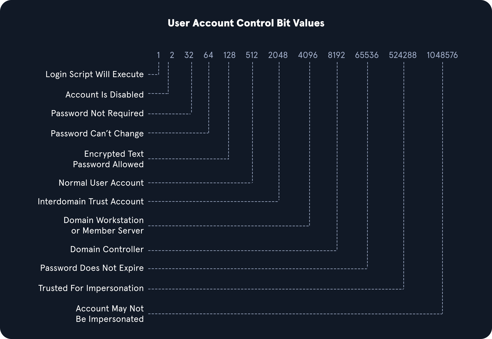

## Credentialed Enumeration - Linux

We are interested in information about domain user and computer attributes, group membership, Group Policy Objects, permissions, ACLs, trusts, and more. We have various options available, but the most important thing to remember is that most of these tools will not work without valid domain user credentials at any permission level. So at a minimum, we will have to have acquired a user's cleartext password, NTLM password hash, or SYSTEM access on a domain-joined host.

### CrackMapExec

```bash
## Domain user enumeration
sudo crackmapexec smb 172.16.5.5 -u forend -p Klmcargo2 --users

## Domain group enumeration
sudo crackmapexec smb 172.16.5.5 -u forend -p Klmcargo2 --groups

## Logged on users enumeration
sudo crackmapexec smb 172.16.5.130 -u forend -p Klmcargo2 --loggedon-users

## Domain Controller Share Enumeration
sudo crackmapexec smb 172.16.5.5 -u forend -p Klmcargo2 --shares

## spider_plus module
## spider_plus will dig through each readable share on the host and list all readable files
sudo crackmapexec smb 172.16.5.5 -u forend -p Klmcargo2 -M spider_plus --share 'Department Shares'
```

### SMBMap

```bash
## Check access
smbmap -u forend -p Klmcargo2 -d INLANEFREIGHT.LOCAL -H 172.16.5.5

## Recursive list of all directories
smbmap -u forend -p Klmcargo2 -d INLANEFREIGHT.LOCAL -H 172.16.5.5 -R 'Department Shares' --dir-only
```

### rpcclient

While looking at users in rpcclient, you may notice a field called rid: beside each user. A Relative Identifier (RID) is a unique identifier (represented in hexadecimal format) utilized by Windows to track and identify objects.

```bash
## User enumeration by RID
queryuser 0x457
```

### Impacket

**Psexec.py**

One of the most useful tools in the Impacket suite is psexec.py. Psexec.py is a clone of the Sysinternals psexec executable, but works slightly differently from the original. 

```bash
## Using psexec.py
psexec.py inlanefreight.local/wley:'transporter@4'@172.16.5.125  
```

**wmiexec.py**

Wmiexec.py utilizes a semi-interactive shell where commands are executed through Windows Management Instrumentation. It does not drop any files or executables on the target host and generates fewer logs than other modules. After connecting, it runs as the local admin user we connected with (this can be less obvious to someone hunting for an intrusion than seeing SYSTEM executing many commands).

```bash
wmiexec.py inlanefreight.local/wley:'transporter@4'@172.16.5.5  
```

**Windapsearch**

The --da (enumerate domain admins group members ) option and the -PU ( find privileged users) options. The -PU option is interesting because it will perform a recursive search for users with nested group membership.

```bash
## Domain admin enumeration
python3 windapsearch.py --dc-ip 172.16.5.5 -u forend@inlanefreight.local -p Klmcargo2 --da

## Privileged users enumeration
python3 windapsearch.py --dc-ip 172.16.5.5 -u forend@inlanefreight.local -p Klmcargo2 -PU
```

## Credential Enumeration - Windows

### ActiveDirectory PowerShell Module

The ActiveDirectory PowerShell module is a group of PowerShell cmdlets for administering an Active Directory environment from the command line.

```powershell
## Discover modules
Get-Module

Import-Module ActiveDirectory

## Get domain info
Get-ADDomain

## Get domain user
## Filter for accounts with the ServicePrincipalName property populated. This will get us a listing of accounts that may be susceptible to a Kerberoasting attack
Get-ADUser -Filter {ServicePrincipalName -ne "$null"} -Properties ServicePrincipalName

## Check for trust relationships
## Useful later on when looking to take advantage of child-to-parent trust relationships and attacking across forest trusts
Get-ADTrust -Filter *

## Domain group enumeration
Get-ADGroup -Filter * | select name
Get-ADGroup -Identity "Backup Operators"            # detailed information
Get-ADGroupMember -Identity "Backup Operators"      # group membership  
```

### PowerView

PowerView is a tool written in PowerShell to help us gain situational awareness within an AD environment. Much like BloodHound, it provides a way to identify where users are logged in on a network, enumerate domain information such as users, computers, groups, ACLS, trusts, hunt for file shares and passwords, perform Kerberoasting, and more. 

```powershell
## Domain user information
Get-DomainUser -Identity mmorgan -Domain inlanefreight.local | Select-Object -Property name,samaccountname,description,memberof,whencreated,pwdlastset,lastlogontimestamp,accountexpires,admincount,userprincipalname,serviceprincipalname,useraccountcontrol

## Recursive group membership
Get-DomainGroupMember -Identity "Domain Admins" -Recurse

## Trust enumeration
Get-DomainTrustMapping

## Testing for local admin access
Test-AdminAccess -ComputerName ACADEMY-EA-MS01

## Finding users with SPN net
## Check for users with the SPN attribute set, which indicates that the account may be subjected to a Kerberoasting attack
Get-DomainUser -SPN -Properties samaccountname,ServicePrincipalName
```

### SharpView

PowerView is part of the now deprecated PowerSploit offensive PowerShell toolkit. The tool has been receiving updates by BC-Security as part of their Empire 4 framework. Another tool worth experimenting with is SharpView, a .NET port of PowerView. Many of the same functions supported by PowerView can be used with SharpView.


### Snaffler

Snaffler is a tool that can help us acquire credentials or other sensitive data in an Active Directory environment. Snaffler works by obtaining a list of hosts within the domain and then enumerating those hosts for shares and readable directories. Once that is done, it iterates through any directories readable by our user and hunts for files that could serve to better our position within the assessment. Snaffler requires that it be run from a domain-joined host or in a domain-user context.

```powershell
Snaffler.exe -s -d inlanefreight.local -o snaffler.log -v data
```

## BloodHound

The tool consists of two parts: the SharpHound collector written in C# for use on Windows systems, or for this section, the BloodHound.py collector (also referred to as an ingestor) and the BloodHound GUI tool which allows us to upload collected data in the form of JSON files. Once uploaded, we can run various pre-built queries or write custom queries using Cypher language. The tool collects data from AD such as users, groups, computers, group membership, GPOs, ACLs, domain trusts, local admin access, user sessions, computer and user properties, RDP access, WinRM access, etc.

```bash
## Executing bloodhound
sudo bloodhound-python -u 'forend' -p 'Klmcargo2' -ns 172.16.5.5 -d inlanefreight.local -c all 
```

### Visualization

We could then type sudo neo4j start to start the neo4j service, firing up the database we'll load the data into and also run Cypher queries against.  We can either upload each JSON file one by one or zip them first with a command such as zip -r ilfreight_bh.zip *.json and upload the Zip file.

Now that the data is loaded, we can use the Analysis tab to run queries against the database. These queries can be custom and specific to what you decide using custom Cypher queries [https://hausec.com/2019/09/09/bloodhound-cypher-cheatsheet/]. 

### SharpHound

```powershell
.\SharpHound.exe -c All --zipfilename ILFREIGHT
```

## LDAP Filtering

You will notice in the queries above that we are using strings such as `userAccountControl:1.2.840.113556.1.4.803:=8192`. These strings are common LDAP queries.

userAccountControl:1.2.840.113556.1.4.803: Specifies that we are looking at the User Account Control (UAC) attributes for an object. This portion can change to include three different values we will explain below when searching for information in AD (also known as Object Identifiers (OIDs)).

=8192 represents the decimal bitmask we want to match in this search. This decimal number corresponds to a corresponding UAC Attribute flag that determines if an attribute like password is not required or account is locked is set. These values can compound and make multiple different bit entries. Below is a quick list of potential values.



### OID match strings
OIDs are rules used to match bit values with attributes, as seen above. For LDAP and AD, there are three main matching rules:

`1.2.840.113556.1.4.803`

When using this rule as we did in the example above, we are saying the bit value must match completely to meet the search requirements. Great for matching a singular attribute.

`1.2.840.113556.1.4.804`

When using this rule, we are saying that we want our results to show any attribute match if any bit in the chain matches. This works in the case of an object having multiple attributes set.

`1.2.840.113556.1.4.1941`

This rule is used to match filters that apply to the Distinguished Name of an object and will search through all ownership and membership entries.

### Logical Operators

When building out search strings, we can utilize logical operators to combine values for the search. The operators & | and ! are used for this purpose. For example we can combine multiple search criteria with the & (and) operator like so:
(&(objectClass=user)(userAccountControl:1.2.840.113556.1.4.803:=64))