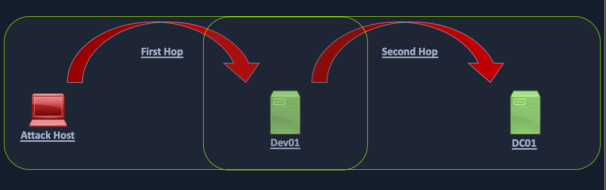

## Privileged Access

What if we don't yet have local admin rights on any hosts in the domain?

There are several other ways we can move around a Windows domain:

- Remote Desktop Protocol (RDP)
- PowerShell Remoting 
- MSSQL Server 

### Remote Desktop

```powershell
## Using PowerView
Get-NetLocalGroupMember -ComputerName ACADEMY-EA-MS01 -GroupName "Remote Desktop Users"
```

*Using Bloodhound, we can also check remote access and other execution rights under the `Execution Rights` tab in Node Info.*

### WinRM

```powershell
## From Windows
## Using PowerView
Get-NetLocalGroupMember -ComputerName ACADEMY-EA-MS01 -GroupName "Remote Management Users"

## Establish WinRM Session from Windows úsing Enter-PSSession
$password = ConvertTo-SecureString "Klmcargo2" -AsPlainText -Force
$cred = new-object System.Management.Automation.PSCredential ("INLANEFREIGHT\forend", $password)
Enter-PSSession -ComputerName ACADEMY-EA-DB01 -Credential $cred
```

```bash
## From Linux perspective
evil-winrm -i 10.129.201.234 -u forend
```

```powershell
## Cypher Query in Bloodhound
MATCH p1=shortestPath((u1:User)-[r1:MemberOf*1..]->(g1:Group)) MATCH p2=(u1)-[:CanPSRemote*1..]->(c:Computer) RETURN p2
```

### SQL Server Admin

```powershell
## Enumerate MSSQL instances with PowerUpSQL
cd .\PowerUpSQL\
Import-Module .\PowerUpSQL.ps1
Get-SQLInstanceDomain

## Authenticate against remote SQL server
Get-SQLQuery -Verbose -Instance "172.16.5.150,1433" -username "inlanefreight\damundsen" -password "SQL1234!" -query 'Select @@version'
```

```bash
## From Linux perspective
mssqlclient.py INLANEFREIGHT/DAMUNDSEN@172.16.5.150 -windows-auth
```

```powershell
## Cypher Query in Bloodhound
MATCH p1=shortestPath((u1:User)-[r1:MemberOf*1..]->(g1:Group)) MATCH p2=(u1)-[:SQLAdmin*1..]->(c:Computer) RETURN p2
```

## Kerberos Double Hop

The "Double Hop" problem often occurs when using WinRM/Powershell since the default authentication mechanism only provides a ticket to access a specific resource. 

The crux of the issue is that when using WinRM to authenticate over two or more connections, the user's password is never cached as part of their login.



If unconstrained delegation is enabled on a server, it is likely we won't face the "Double Hop" problem. In this scenario, when a user sends their TGS ticket to access the target server, their TGT ticket will be sent along with the request. 

### Workarounds 

```powershell
## Set up PSCredential Object to pass credentials again
import-module .\PowerView.ps1
get-domainuser -spn
$SecPassword = ConvertTo-SecureString '!qazXSW@' -AsPlainText -Force
$Cred = New-Object System.Management.Automation.PSCredential('INLANEFREIGHT\backupadm', $SecPassword)

## Credentials passed
get-domainuser -spn -credential $Cred | select samaccountname
```

```powershell
## Register PSSession Configuration
Register-PSSessionConfiguration -Name backupadmsess -RunAsCredential inlanefreight\backupadm

## Re-establish session
Register-PSSessionConfiguration -Name backupadmsess -RunAsCredential inlanefreight\backupadm
```

*Note: We cannot use Register-PSSessionConfiguration from an evil-winrm shell because we won't be able to get the credentials popup.* 
